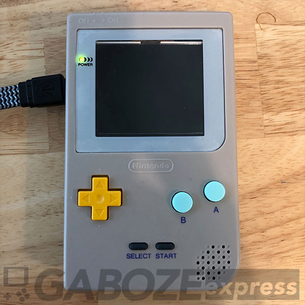
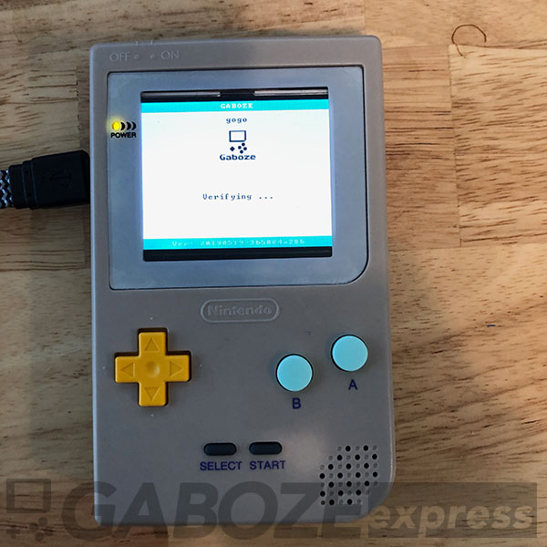
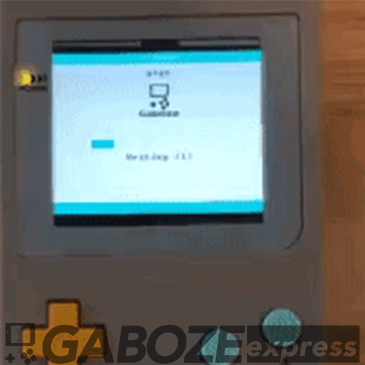

# 
> Software Branch

This branch contains the specific modification for the Odroid Go hardware to use the 320x240 ILI9342 2.6" display

- [x] Odroid Go - [Firmware](https://github.com/OtherCrashOverride/odroid-go-firmware)
- [x] Odroid Go - [Go Play Emulators](https://github.com/OtherCrashOverride/go-play)
- [x] Launcher based on [GoGo](https://bitbucket.org/odroid_go_stuff/gogo/src/master/) Launcher

# Usage
> How To

Clone the Software Branch of the [Official Gaboze Express](https://github.com/gaboze-express/GabozeExpress)

```shell
git clone -b Software --single-branch git@github.com:gaboze-express/GabozeExpress.git --recursive
git submodule update --init --recursive
git submodule foreach git pull origin master
```
It will take a while since we run a few ```git submodule``` inside the repository

# Setup Toolchain
> You will need the xtensa esp32 toolchain

### Guides

***Note:*** You only need to install the xtensa toolchain. The esp-idf is included in this repository.

- [Linux](https://docs.espressif.com/projects/esp-idf/en/latest/get-started/linux-setup.html)
- [Mac OS](https://docs.espressif.com/projects/esp-idf/en/latest/get-started/macos-setup.html)
- [Windows](https://docs.espressif.com/projects/esp-idf/en/latest/get-started/windows-setup-scratch.html)


# Bash Scripts
> Some tools to help you along your way

Navigate to you newly cloned repository and execute the following
```
chmod -R 777 Scripts
cd Scripts
```

***Note:*** All bash scripts **MUST** be executed from the Scripts folder.


### Submodule Branches
> Make sure all the submodules are on the right branches

```
./branches
```

### Replace files for ILI9342 drivers
> Copy relevant files for ILI9342 TFT LCD

```
./replace
```

### ESP32 Environment Installer
> Install all thing necessary (NIX/OS X)

```
./installer
```

### Environmanet Variables
> Set all your paths
Be sure to run installer first

```
source paths
```

### Build Firmware

> Execute ```source paths``` before proceeding


##### Follow Onscreen Prompts
> if this is your first time running the executable, answer **Y** to the options

```
./firmware
```

You will now have a file called **GabozeExpress.fw** in the Firmware/Release folder.

You can copy this onto your *SD Card* into the ***odroid/firmware*** folder

##### Enabling new firmware
> Insert the sd card into your Gaboze Express (Odroid Go) and follow the prompts

| Power On | List                    | Selection     |    Verification  |   Write   |   Reboot   |
| ----------------------------------------- | -------------------------------- | ---- | ---- | ---- | ---- |
|  |  |      |      |       |      |


### OTA
> Flash directly to ESP32

```
./ota
```

### Erase
> Erase flash and storage from ESP32

```
./erase
```

### Arduino
> Create Firmware from Arduino ```.ino.bin``` file

```
./arduino
```

You will now have a ```.fw``` file in Arduino/firmware folder.

You can copy this onto your *SD Card* into the ***odroid/firmware*** folder
